# Canberk's Pizza
Canberk's Pizza is a MERN stacked web application for ordering pizza.

# Live Website
https://food-app-next-js-psi.vercel.app/

# How it works? 
1- Add your products to the cart with the selected size, quantity, and extras.  
2- Go to your cart and select "Checkout Now!" -> PayPal   
3- Enter the information of the shared paypal sandbox accounts.  
4- After successfully making the payment, you can track the status of your order.  
5- You can forward the status of your order through the admin panel and refresh the order status page to see the updated status.  

You can apply CRUD operations for the products if you logged in as admin. (Credentials at the below)

# Admin User
**Username:** admin1  
**Password:** 123456

# Paypal Sandbox Accounts
**Customer Username:** sb-xkz3t25842579@personal.example.com  
**Customer Password:** +Jj+T8z3

**Merchant Username:** sb-eagqy25842580@business.example.com  
**Merchant Password:** &T8ru?7I

# Technologies Used 
* React
* Next.js
* Node.js
* MongoDB
* Express
* Mongoose
* Redux
* Axios
* Cookies
* Restful API
* Postman (API testing)
* Cloudinary API
* Paypal API
* JavaScript
* HTML
* CSS

# Features
* Fully responsive design.
* Redux for complex state management.
* Payment via Paypal.
* Admin panel for tracking available products, user orders, and updating the status.
* Adding items to the menu via Cloudinary if you logged in as Admin.
* Cookies for recognizing the user.
* Route guarding.
* CRUD operations for foods using the admin panel.

# Screenshots

Featured page with slidable images.

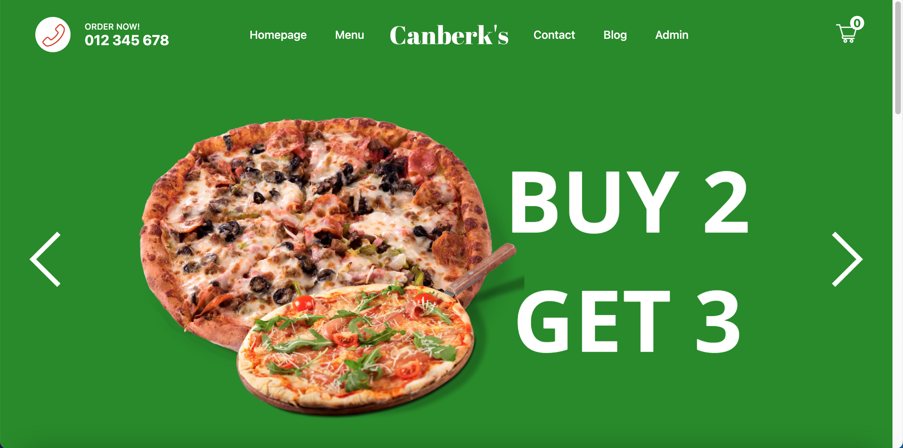

Menu

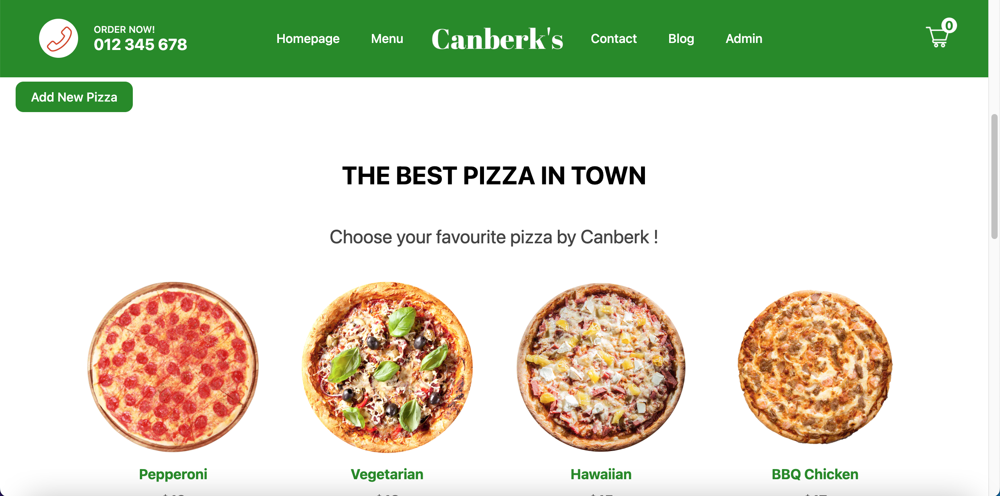
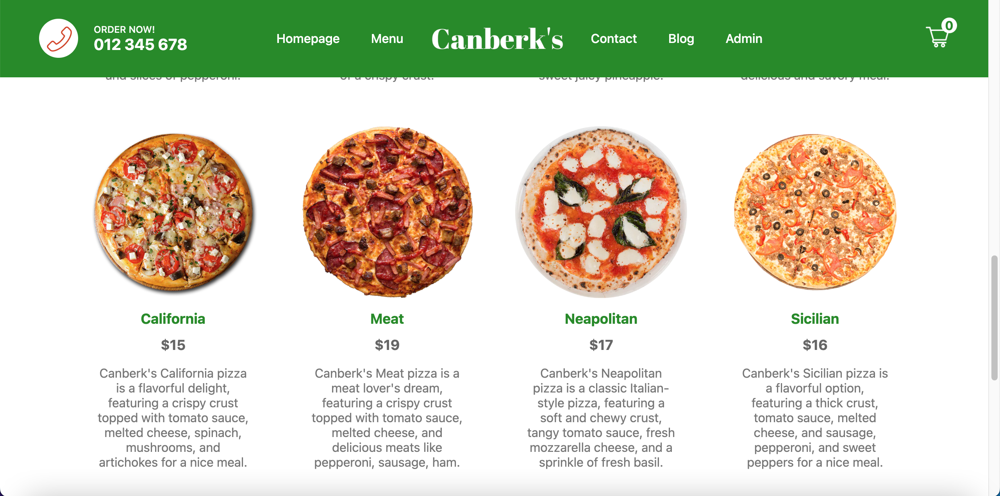

Footer

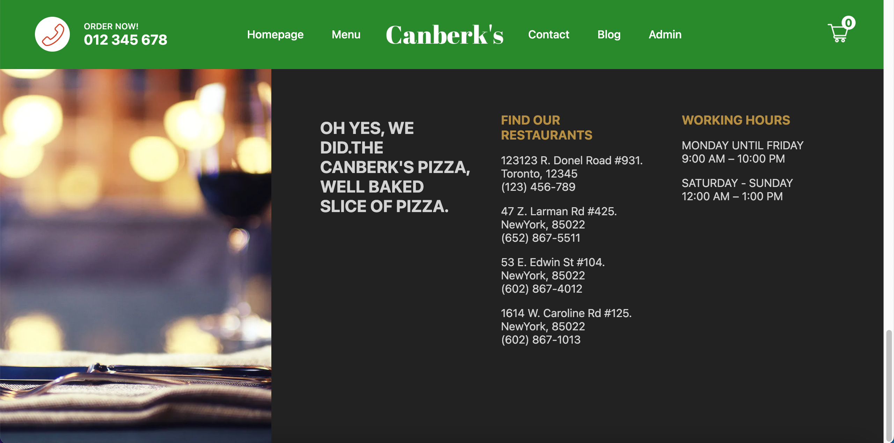

Add your favourite pizzas on clicking menu images. 

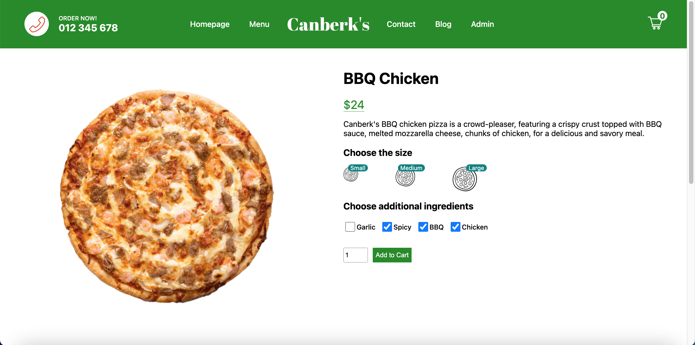

Go to your cart to make the payment for your products.

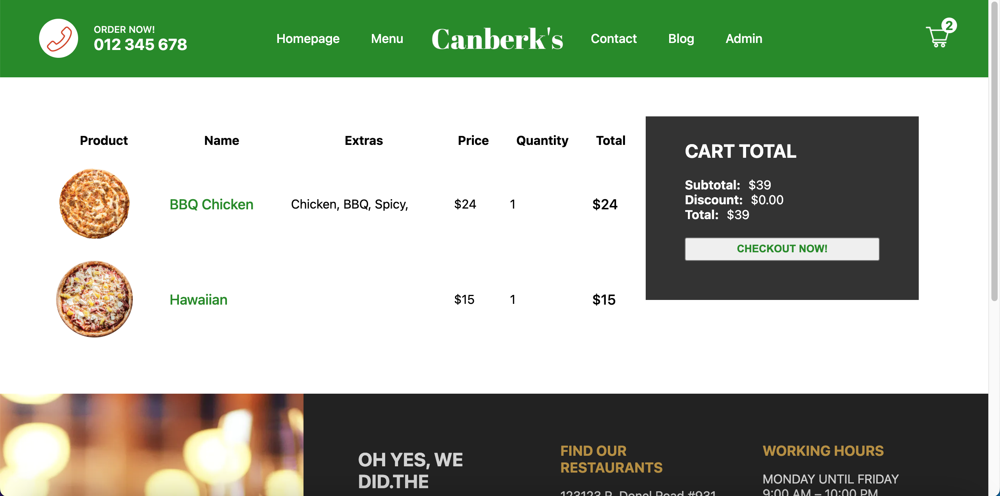

Checkout with PayPal (credentials shared) (check the transaction with shared credential).

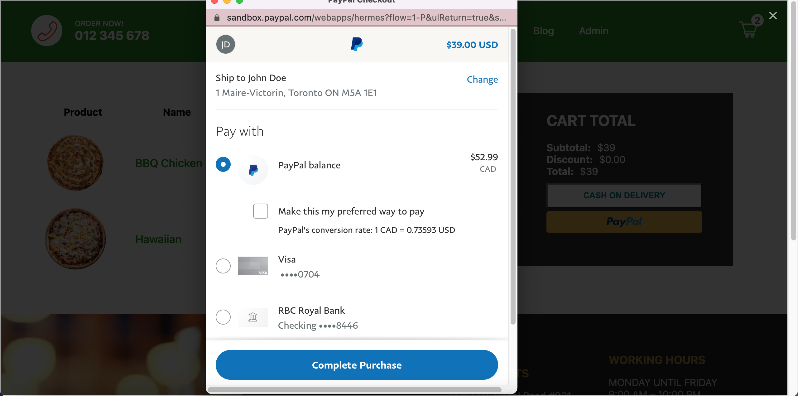

On successful payment, redirected to the order tracking page.

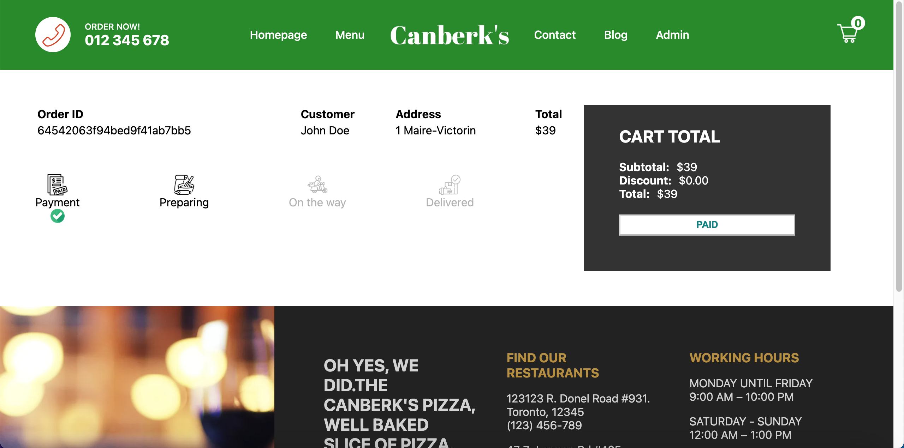

Login as admin (credentials shared).

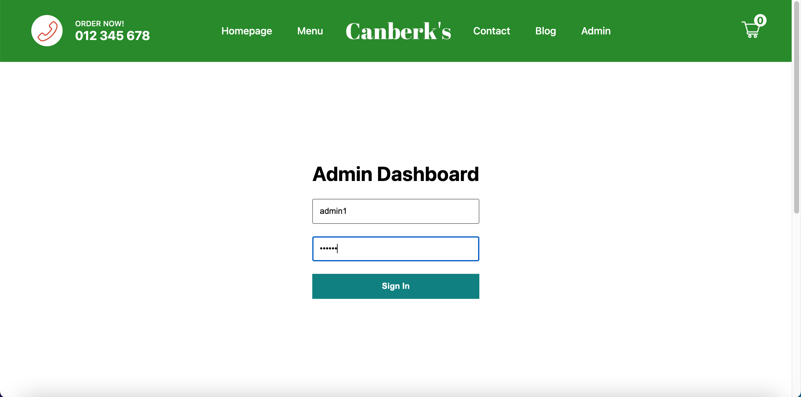

On successful login, redirected to the admin panel dashboard where you can forward order status as well as deleting the products.

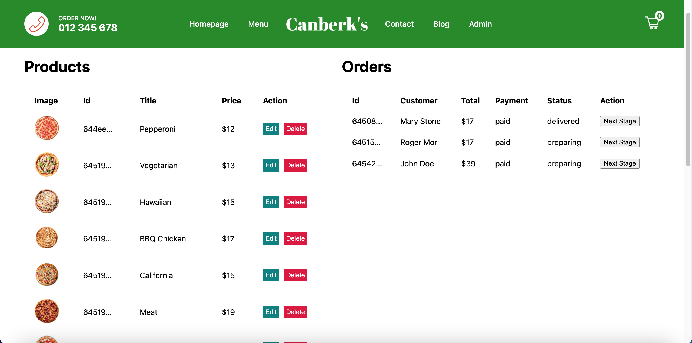

Forwarding order.

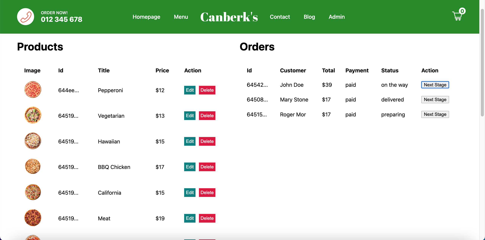

Refresh the order tracking page.

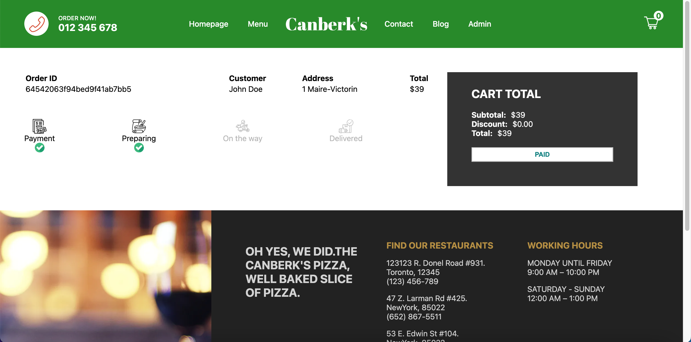

Add Item. (Only if you logged in as Admin)

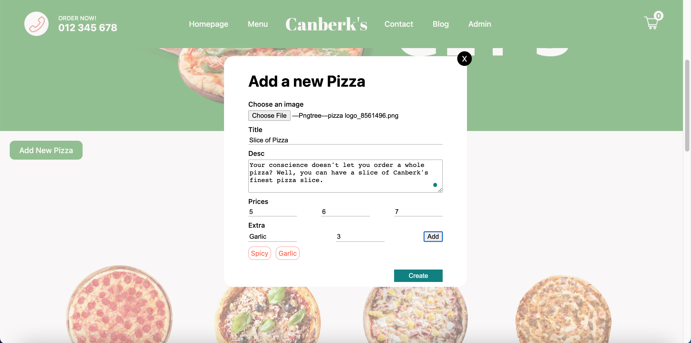

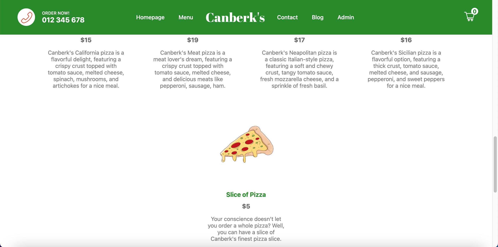

Checkout the newly added Item in admin panel.

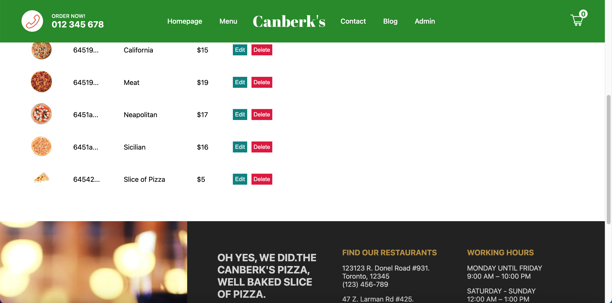

